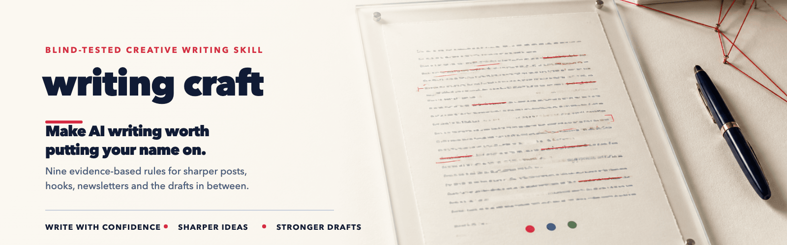

<p align="center">
  
</p>

<p align="center">
  <b>Most writing skills are someone's opinion about good writing.</b><br>
  These nine came out of a <b>blind test</b> of 50 samples, scored by three AI judges who had no idea who wrote what. Then they were measured in a <b>second blind test</b>.<br>
  <br>
  Works in Claude Code, Codex, Gemini, or pasted into any chat.<br>
  The skill itself is two files: <code>SKILL.md</code> and <code>check.py</code>.
</p>

<p align="center">
  <a href="#install">Install</a> ·
  <a href="#the-nine-rules">The nine rules</a> ·
  <a href="#does-it-actually-work">Does it work</a> ·
  <a href="#where-the-nine-came-from">Where they came from</a>
</p>

---

Five models were given the same five everyday writing jobs, twice each. Fifty outputs. Filenames scrambled, punctuation stripped, the answer key locked until every score was in. Three judges then scored all fifty blind and were each asked one open question, in their own words, with no vocabulary supplied: **what separated the high scorers from the low ones?**

Nine signals came back. All three judges named the first four independently, without seeing each other's answers.

The skill turns those nine signals into rules the model writes to. **Load it, ask for the copy you wanted anyway, and the draft comes back better.** The model writes to the nine, checks its own work against the three that are measurable, fixes what missed, and only then hands it to you.

You don't run anything. You don't paste a draft in for marking. You ask for a post and get a better post.

---

## Does it actually work

The same blind test was run on the skill itself. Sonnet 5 with it and without it, judged in one sitting by GPT-5.6 Sol, same five prompts, twice each. The only thing that changed between the two rows was whether the skill was loaded.

It measurably improved the writing: better on all five prompts, worse on none, and a perfect score on the three-angles prompt. It didn't overtake the larger model. That's the honest result, and it's the more useful one, because a lot of what looks like model quality turns out to be instructions.

<details>
<summary><b>The scores (spoilers if you have not watched the video)</b></summary>

<br>

| | Score out of 15 |
|---|---|
| Claude Sonnet 5, on its own | 10.2 |
| **Claude Sonnet 5, with the skill** | **12.3** |
| Claude Opus 5, same test | 14.8 |

**46% of the gap to the larger model, closed, on a cheaper model, for free.**

- Better on all five prompts. Worse on none.
- A perfect 15 on the three-angles prompt, level with the larger model.
- Same prompts, same judge, one change.

> Read the decimals as a direction, not a measurement. Each score is the mean of 10 pieces.

</details>

---

## Install

The rules are plain markdown with no tooling assumptions. Pick whichever matches where you write.

### Claude Code

```bash
curl -fsSL https://raw.githubusercontent.com/Ptlimited/writing-craft/main/install.sh | bash
```

Or clone and run it yourself:

```bash
git clone https://github.com/Ptlimited/writing-craft.git
cd writing-craft
./install.sh              # all projects  → ~/.claude/skills/writing-craft
./install.sh --project    # this repo only → ./.claude/skills/writing-craft
```

Start a new session afterwards so it gets picked up.

### Codex

Paste the contents of `SKILL.md` into your `AGENTS.md`.

### Gemini, OpenRouter, ChatGPT, or anything else

Paste the nine rules at the top of the chat, or drop them into whatever custom-instructions box the tool gives you. There's nothing model-specific in them.

### By hand, with no model at all

They were written from what judges noticed while reading, so they work as an editing checklist on your own drafts.

`check.py` is standalone Python 3 with no dependencies, so the gate runs against any draft from any source.

> **On triggering.** In Claude Code the `description:` line in `SKILL.md` is deliberately wide, so it fires on almost any writing request. That's what you want. To confine it, narrow that line before installing. Hooks and angle lists are where it measured strongest.

---

### What's in here

| | |
|---|---|
| `SKILL.md` | The nine rules, the gate protocol, and where they came from. This is the skill. |
| `check.py` | The mechanical checks. Standalone Python 3, no dependencies. |
| `install.sh` | Copies those two into Claude Code. Optional, the manual copy is two lines. |
| `README.md` `LICENSE` `.gitignore` | Packaging. |

Two files do the work. Everything else is wrapping.

## The nine rules

| # | Rule | | Enforced by |
|---|--------|---|---|
| 01 | **Specificity you earned** | A number, an incident, a duration. Something pointless to invent. | Model judgment |
| 02 | **Argue with the brief** | Add what the brief did not contain. Agreeing with it reads as forgettable. | Model judgment |
| 03 | **One analogy, driven** | Keep the one that makes a distinction you could not make without it. | Model judgment |
| 04 | **No stacked shapes** | Litany opener, aphorism close, question to the reader. Two together and the shape came first. | Model judgment |
| 05 | **Cut the hedges** | might, may, often, probably. Hedge twice in a paragraph and the point of view is gone. | `check.py` |
| 06 | **Options that differ** | Three angles means three, not one premise wearing three hats. | Model judgment |
| 07 | **Contractions** | The lowest scorers narrate: "it is", "do not", "you are". The highest ones speak. | `check.py` |
| 08 | **Vary the rhythm** | One long sentence because the thought runs on, then a short one that stops. | `check.py` |
| 09 | **Do not invent it** | Rule 1's counterweight. Every claim sourced or flagged, never fabricated. | `check.py` lists them, you decide |

Three of the nine are numbers, so `check.py` decides those. Rule 9 it does half of: it pulls out every claim, then you or the model decide which ones are backed up. The other five the model has to argue, and write down what it concluded. A silent pass isn't a pass.

**Two checks were built and cut**, which is worth knowing:

- A detector for the stacked shapes in rule 4 fired on the best and the worst writing at the same rate. So rule 4 goes back to the model to argue, the way the judges saw it.
- Counting numbers as a proxy for rule 1 runs backwards. The *weakest* writing in the test carried more numbers than the strongest, because it made them up. That is exactly why rule 9 exists.

---

## The check it runs on itself

Three of the nine are numbers, so the skill settles them with `check.py` before the draft ever reaches you. This all happens inside the writing step. You see the result, not the process.

Here is what the skill is looking at.

### What a good draft looks like

Run against the LinkedIn post that every judge scored **15 out of 15** in the original test:

```
writing-craft mechanical checks: PASS  (265 words, 24 sentences)

  [ok  ] 5. Cut the hedges
         0.38 against 0.5 per 100 words
         found: likely x1

  [ok  ] 7. Contractions
         1.0 against 0.7 contracted / (contracted + expanded)
         found: none

  [ok  ] 8. Vary the rhythm
         0.55 against 0.45 coefficient of variation, sentence length
         found: 24 sentences, mean 11.0 words
```

### What it catches and fixes

```
writing-craft mechanical checks: FAIL  (118 words, 9 sentences)

  [FAIL] 5. Cut the hedges
         7.63 against 0.5 per 100 words
         found: may x1, often x1, tends to x1, somewhat x1, generally x1,
                typically x1, quite x1, can be x1, likely x1
         fix:   Cut them, or commit to the claim. Keep one only if you can
                say why it is load-bearing.

  [FAIL] 7. Contractions
         0.0 against 0.7 contracted / (contracted + expanded)
         found: it is x2, you are x1, is not x1
         fix:   Expanded forms mean the piece is being narrated, not said.
                Contract them.

  [FAIL] 8. Vary the rhythm
         0.28 against 0.45 coefficient of variation, sentence length
         found: 9 sentences, mean 13.1 words

  Rule 9. Claims needing a source before this ships:
         line 5: percentage - "40%"
         line 6: first-person claim - "I tested"
         line 5: appeal to research - "Research shows"
```

When a draft misses, the skill names the rule, the amount, and what to cut, then **fixes it and re-checks** instead of handing you the failure. A firing check isn't a rejection, it's one revision pass in which a hedge is either cut or defended.

**If you do want to run it by hand**, on your own writing or anything a model gave you, it works standalone on any file, with no dependencies:

```bash
python3 check.py draft.md
python3 check.py draft.md --hooks     # zero tolerance on hedging, for hook lists
cat draft.md | python3 check.py -
python3 check.py draft.md --json
```

Exit code is `0` when the three measurable rules pass and `1` when any fail, so it drops into a pre-commit hook or CI.

This page passes it: hedges 0.06 against a 0.5 ceiling, contractions 0.91 against a 0.70 floor, rhythm 0.68 against a 0.45 floor. The one hedge left is the deliberately bad hook quoted above.

---

## What to use it for

Anything you write for someone else to read. A post, a newsletter, an email, a landing page, ad copy, hooks, an essay, a script. It has no house style of its own, so it won't make everything sound the same. It just stops the draft doing the things three judges marked down when they had no idea who wrote what.

It was measured on five everyday jobs: a rough thought turned into a post, a newsletter opening, three angles on a topic, a punch-up of flat copy, and ten hooks. That's what the numbers cover. It isn't what the skill is limited to.

Where it does the most work:

- **Ask for three angles and most models hand you one idea in three hats.** Rule 6 makes each option change what the finished piece would be, and give you a reason it works on a reader. This is where the skill scored highest, level with the larger model.
- **Hooks get their own mode**, with no hedging allowed at all. "Your prompt might be making it worse" is a shrug. "I'll bet you can't explain why half those lines are there" is a dare.
- **It lists every claim it made.** Numbers, percentages, dates, any "I tested this". They come back as a list, so you can check them yourself instead of finding out later.
- **Run it against itself.** Same prompt, once with the skill and once without. That's how it was measured, and it's the quickest way to see if it's worth keeping.
- **It sits next to your own style guide.** This is about craft, not how you sound, so the two don't fight. Your rules win every time they disagree.

---

## How it works

1. **You ask for the copy.** Nothing special: "turn this into a LinkedIn post", "give me ten hooks".
2. **The rules shape the draft as it's written.** They aren't a clean-up pass afterwards, which is the whole reason it works.
3. **`check.py` runs** on rules 5, 7 and 8, and extracts rule 9's claim list.
4. **The model works through the six it has to argue** and writes down its conclusion on each.
5. **It fixes what failed and re-checks**, up to two passes.
6. **You get the finished draft.** If something still fails after two passes it tells you, instead of shipping quietly.

---

## Where the nine came from

Five models (Claude Opus 5, Claude Sonnet 5, and OpenAI's GPT-5.6 Sol, Terra and Luna) were each given the same five everyday writing jobs, twice: a rough thought into a LinkedIn post, a newsletter opening, three different angles on a topic, a punch-up of flat copy, and ten hooks. Fifty outputs.

Then the part that makes it a test and not a preference, in this order:

1. **One folder each.** Read and write only that folder.
2. **Every filename scrambled.** Only the prompt number and output sequence survive.
3. **Punctuation stripped across all fifty.** Em dashes, en dashes, smart quotes. Otherwise you identify a model by its dash habit in about two seconds, and then you're scoring the label instead of the writing.
4. **The model identities locked away** until every score was in.
5. **No judge saw another judge's scores.**

### The jury

**Three judges, two labs, every one of them scoring blind.**

| Judge | Why it was there |
|---|---|
| **Fable 5** | The outsider. Not competing, so it had no work of its own in the pile. An Anthropic model, which is also the problem with it. |
| **GPT-5.6 Sol** | The rival. OpenAI's flagship, and a competitor here. If Claude writing is overrated, this is the judge that finds out. |
| **Claude Opus 5** | The other flagship. Also competing, so both labs face identical conditions. |

Two of the three had their own writing in the pile, so every model was marked by all three and nobody got a softer panel.

### The three questions

Each piece got three scores, 1 to 5, so **15 is a perfect piece**:

| | |
|---|---|
| **Human** | Does it sound like a person wrote it? |
| **Usable** | Could you ship it? |
| **Post** | Would a working writer put their name on it? |

Scored down a column, never across a row. Every model answered each prompt twice, so nothing rides on one lucky attempt. Ten pieces per model.

Each judge was then asked one open question, identical for all three, with no vocabulary supplied: what separated the high scorers from the low ones, in your own words. None of them saw another's answer. The nine signals are what came back, and all three independently named the first four.

### The numbers behind the three checks

Set against those same 50 files, using the average of what the three judges gave each one for sounding human:

| Check | Threshold | Fires on the best (n=19) | Fires on the worst (n=12) |
|---|---|---:|---:|
| Hedges | > 0.5 per 100 words | 4 | 9 |
| Contractions | ratio < 0.7 | 2 | 8 |
| Rhythm | sentence-length CV < 0.45 | 2 | 10 |
| **Any of the three** | | **7** | **12** |

Sentence rhythm is the strongest of the three. Together they caught 12 of 12 of the lowest scorers, at the cost of firing on 7 of 19 of the highest. That false-positive rate is deliberate.

---

## Uninstall

```bash
rm -rf ~/.claude/skills/writing-craft
```

Or `.claude/skills/writing-craft` if you installed it into a single project.

---

## License

MIT. See [LICENSE](LICENSE). Use it, change it, ship it in your own tooling.

---

## More like this

The blind test keeps running. As new models land they go through the same five prompts, the same three questions and the same blind set, so the scores line up against these ones and you can see what actually changed.

The point isn't the leaderboard. It's more ways to get more out of the setup you already have, the way this skill got a cheaper model closer to a flagship without changing anything else.

Star the repo if it made a draft better, and it'll be waiting when the next one runs.

Used it? Say how it went. That feedback shapes what gets tested next.

**[Join the newsletter: see which model wins the next blind test →](https://withpt.ai/resources/writing-craft#newsletter)**
